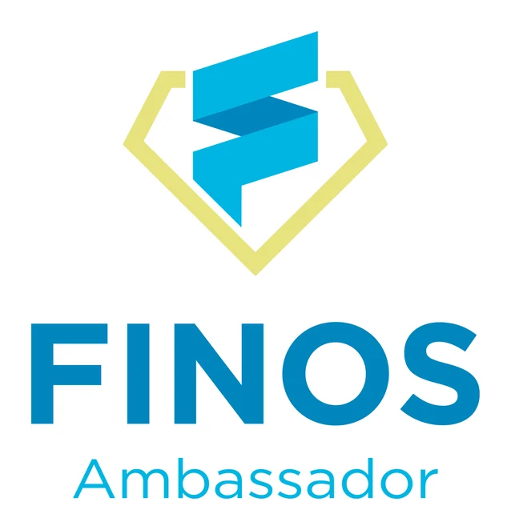

# FINOS Ambassadors

## Background 

The FINOS Ambassador program aims to grow the organization's global presence by recognizing vocal advocates and expanding representation at external events. It encourages adoption and contributions to key projects while stimulating technical content production and attracting new contributors. Additionally, the program creates opportunities for FINOS Community members to engage with diverse talent locally.

## Why is this important?

The FINOS Ambassador program offers a unique opportunity to make a meaningful impact on both a local and global scale. By joining, you'll help grow FINOS's community presence worldwide and drive adoption of its key projects and initiatives. As an Ambassador, you'll receive formal recognition for your advocacy efforts and have the chance to expand FINOS's representation at external events. Additionally, you'll play a vital role in stimulating the production of technical content and attracting new contributors to FINOS and FINOS Labs. Most importantly, by engaging with local and diverse talent, you'll help create a more vibrant and inclusive community within FINOS. Join the Ambassador program today and be a part of shaping the future of open source finance technology.

## What are the responsibilities of a FINOS Ambassador?

As a FINOS Ambassador, you'll have several key responsibilities to help advance the organization's mission. On a quarterly basis, you'll organize FINOS meetups or webinars, contribute technical or thought leadership blogs, source speakers for the FINOS Open Source in Finance Podcast, participate in events or work at FINOS booths, and author case studies on FINOS projects. Additionally, on an ongoing basis, you'll promote FINOS events and projects through social and individual networks, and actively greet and mentor potential and new contributors, ensuring a welcoming and inclusive environment aligned with FINOS and Linux Foundation Codes of Conduct. These responsibilities are essential for fostering community engagement and driving the growth and success of FINOS initiatives.

## FINOS Ambassador Benefits

Participating in the FINOS Ambassador Program offers a range of valuable benefits

- Formal FINOS Credly Ambassador Badge: Receive recognition with an official badge for use on social media, websites, and business cards.
- Ambassador-only swag package: Enjoy exclusive FINOS merchandise as a token of appreciation.
- Emeritus status: Have the option for Emeritus status if you need to pause or leave the Ambassador Program temporarily.
- Free attendance at OSFF: Gain complimentary access to the Open Source in Finance Forum.
- Access to Ambassador-only FINOS Slack channel and periodic quarterly
- FINOS Ambassador roundtables: Connect with other Ambassadors for networking and collaboration.
- Discount codes for FINOS related trainings: Access training opportunities at discounted rates.
- Right of first refusal on:
   - Opportunities to speak on Open Source in Finance Podcast
   - FINOS All Community Calls
   - OSFF (London / NY)
   - Creating training assets such as testing new exams or creating questions.
   - These benefits enhance your experience as an Ambassador and provide valuable opportunities for networking, professional development, and recognition within the FINOS community.
 
## Meet Our Ambassadors  

| **Name**                      | **Title & Company**                                |
|-------------------------------|---------------------------------------------------|
| **Olivier Poupeney**          | Head Ambassador, Head of Developer Relations, Orkes |
| **Peter Smulovics**           | Executive Director, Morgan Stanley                |
| **Luca Borella**              | Co-founder & CEO, Algoritmica.ai                  |
| **Mike Minett**               | Growth Partner, turntabl.io                       |
| **Cody Zuschlag**             | Senior Developer Relations Engineer, Nearform     |
| **Sam Moorhouse**             | Founder & CEO, turntabl.io                        |
| **Brittany Erica Istenes**    | OSPO Strategist, Fannie Mae                       |
| **Vinod Goje**                | VP Engineering Manager, Bank of America           |
| **Neil McGonigle**            | Key Account Director MySQL Global Business Unit   |
| **Daniel Paes**               | Director of CloudOps & DataOps                    |
| **Lanciné Kone**              |   CIO chez MEGASERVICE                            |
| **Tiejun Chen**               | Seasoned Tech Lead - {ML/AI, Edge Computing, Cloud Native, Virtualization, RISC-V}                              |
| **David Rutledge**               | Founder of Ledger Integrations                             |
| **Elisha Chitsenga**        | Accountant, Auditor & Founding Director, Crestly Resorts                                           |
| **Junji Katto**             | Head of Risk and InfoSec, Carbonplace UK Limited   
| **Dr Gulzar Singh**         |   Senior Fellow, Banking & Digital Strategy                                                                   |
| **Khalid Elsawaf**  | Secured Financing Tech (SFT) Post-Trade Lead Architect and Prime Brokerage & Secured Financing Tech (PBSFT) Montreal Lead, Morgan Stanley                                                                     |
| **Ali Nawaz**    | Grandmaster in Google’s ML Campaigns and Community Organizer at TensorFlow User Group Islamabad                       |

## Ambassador Map

## How to get involved

To join the FINOS Ambassador Program, overseen by Lead Ambassador Olivier Poupeney, Head of Developer Relations at Orkes, individuals are selected for their deep understanding of the FINOS community, its members, and the project landscape. Ambassadors typically focus on specific regions, projects, technology areas (like AI or Cloud), or aspects of financial services (such as pre-trade, post-trade, ESG, Payments, or Retails). 

If you're interested in becoming an Ambassador or know someone who would be a great fit, please fill out the interest form below on the [FINOS Ambassador landing page](https://www.finos.org/ambassador-program#how_to_get_involved).

## Raise an issue

If you have any questions or suggestions, please [raise an issue](https://{github}.com/finos/ambassadors/issues/new/choose)

## Join the mailing list 

Communications for the FINOS Ambassadors project are conducted through the FINOS Ambassadors@lists.finos.org mailing list. Please email [ambassadors@lists.finos.org](mailto:ambassadors@lists.finos.org) to join the mailing list.

## License

This project uses the **Community Specification License 1.0** ; you can read more in the [LICENSE](LICENSE) file.
